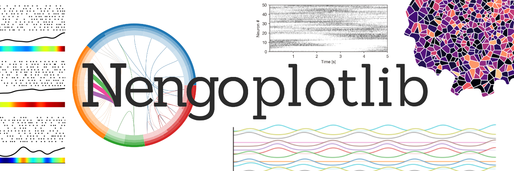


# nengoplotlib

Plotting utilities for [Nengo](https://www.nengo.ai) networks: connectome
diagrams, spike rasters, activity heatmaps, multi-trial PSTHs, animations, and
brain-atlas region maps. Pure matplotlib output.

## Installation

Install from a local clone:

```bash
git clone https://github.com/ctn-waterloo/nengoplotlib.git
cd nengoplotlib
pip install .
```

The connectome plots require [Nengo](https://www.nengo.ai). Install it alongside
nengoplotlib with the `nengo` extra:

```bash
pip install ".[nengo]"
```

For development (tests + nengo):

```bash
pip install -e ".[dev]"
```

```python
import nengoplotlib as npl
```

To regenerate every figure on this page, run
[`examples/make_example_images.py`](examples/make_example_images.py).

---

## Plot gallery

### `plot_spikes` — alpha-channel grayscale raster

A spike raster drawn with `imshow` and a transparent-to-black colormap, so it
can be overlaid on other artists. Pair with `sort_neurons(...)` to cluster
similar trains together.

```python
sorted_X, _ = npl.sort_neurons(spikes, t=t, method='cluster', n_out=50, smoothing=0.002)
npl.plot_spikes(t, sorted_X)
```

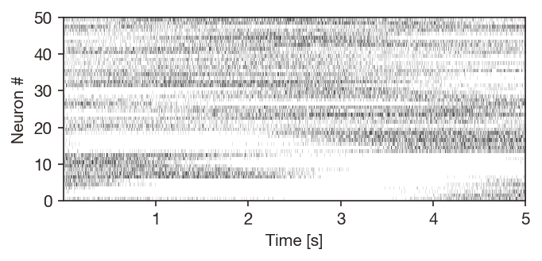

### `plot_heatmap` — pcolormesh activity heatmap

`pcolormesh` view of an already-smoothed (time × neuron) activity matrix. Use
`npl.smooth(...)` to convert spikes to rates first if needed.

```python
filtered = npl.smooth(sorted_X, t=t, filter_width=0.02)
npl.plot_heatmap(t, filtered, cmap='viridis')
```

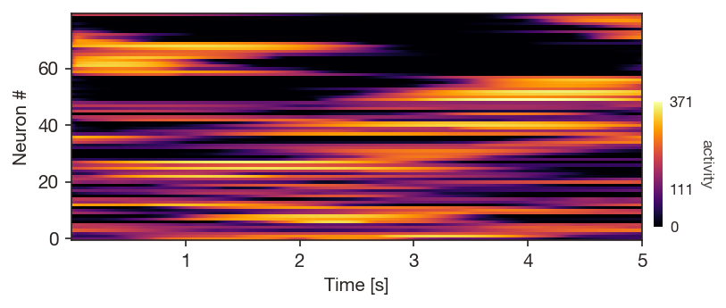

### `plot_traces` — stacked-offset traces (calcium-imaging style)

Each trace is normalized to its own max and stacked vertically. Optional white
fill underneath each trace creates the layered look common in calcium-imaging
papers.

```python
filtered = npl.smooth(spikes[:, ::10], t=t, filter_width=0.1)
npl.plot_traces(t, filtered, offset=0.6, cmap='tab10')
```

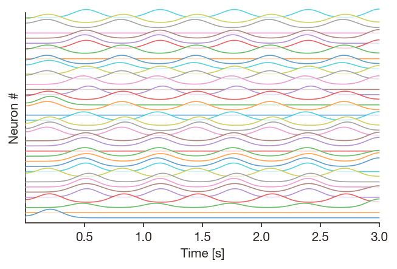

### `plot_psth` — per-neuron multi-trial raster + smoothed rate

For each chosen neuron, three rows: trial raster, trial-averaged smoothed
firing rate, and a colored intensity bar of the same rate.

```python
npl.plot_psth(trials, t=t, neuron_idxs=[10, 30, 100], smoothing_sigma=50)
```

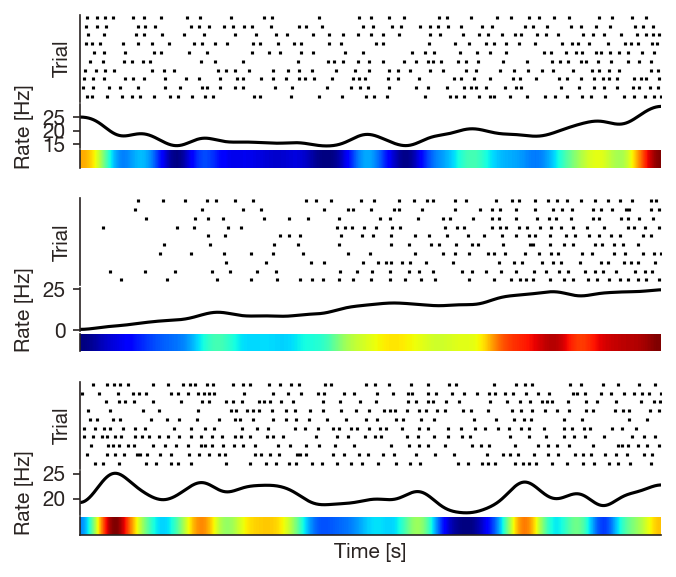

### `plot_scrolling_raster` — animated scrolling raster

Returns a `matplotlib.animation.FuncAnimation`. Recent spikes are colored by
their synapse-filtered amplitude so transient bursts stand out.

```python
ani = npl.plot_scrolling_raster(t, sorted_X, window=1.0, tau=0.01)
ani.save('scroll.gif', writer='pillow', fps=15)
```

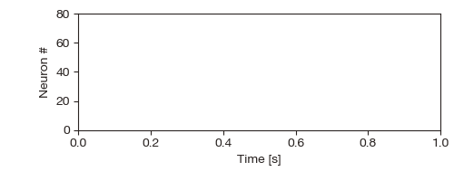

### `plot_grid_animation` — animated 1D / 2D grid

Color each cell in a rect / hex grid by the instantaneous activity of its
neuron. Positions can be supplied directly or pulled from a fitted
`NeuronSorter` (e.g. a SOM sorted by encoders).

```python
sorter = npl.NeuronSorter(
    method='som', ndim=2, grid='hex', grid_shape=(15, 15), metric='cosine',
).fit(spikes, features=ens.encoders)
ani = npl.plot_grid_animation(t, spikes, sorter=sorter, tau=0.02, cmap='magma')
ani.save('grid.gif', writer='pillow', fps=15)
```

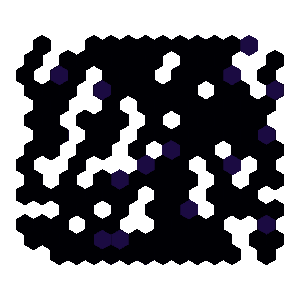

### Voronoi parcellation — organic, variable-shape regions

For a more organic layout than a fixed hex/rect grid, the
`voronoi` and `voronoi_kmeans` sort methods produce a list of irregular
polygons clipped to an alpha-shape (concave hull) of the point cloud.
`plot_grid_animation` picks up `sorter.patches` automatically and recolors
them every frame.

```python
positions = ...  # any (n_neurons, 2) layout — encoders, PCA/UMAP of features, ...

# One Voronoi cell per neuron:
sorter = npl.NeuronSorter(method='voronoi').fit(spikes, positions_2d=positions)

# Or cluster first, then Voronoi the centroids:
sorter = npl.NeuronSorter(
    method='voronoi_kmeans', n_clusters=36, alpha_factor=3.0,
).fit(spikes, positions_2d=positions)

ani = npl.plot_grid_animation(t, spikes, sorter=sorter, tau=0.05, cmap='magma')
```

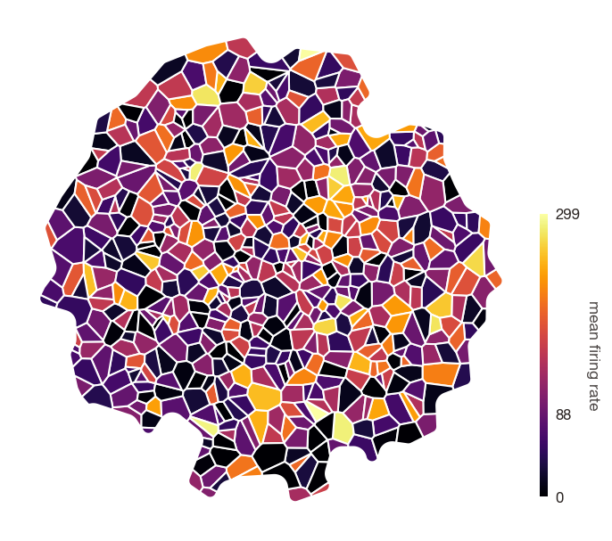

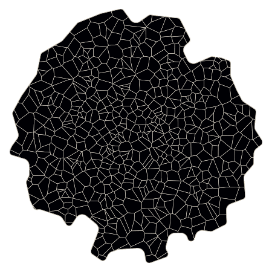

### `plot_phase_portrait` — vector field of a decoded connection

For a connection whose output lives in the same space as its input (typically
a recurrent connection), this samples ``pre``'s input space on a regular
grid, evaluates the connection's decoded function at every grid point, and
plots ``output − input`` as a vector field. Supports 1D, 2D, and 3D
ensembles; 2D supports both ``'quiver'`` and ``'stream'`` styles.

```python
with nengo.Network(seed=0) as model:
    ens = nengo.Ensemble(200, 2)
    conn = nengo.Connection(
        ens, ens, synapse=0.1,
        function=lambda x: [x[0] - 1.5 * x[1], 1.5 * x[0] + x[1]],
    )
sim = nengo.Simulator(model)  # no need to run -- only build-time decoders are needed
npl.plot_phase_portrait(ens, conn, sim=sim, plot_type='stream')
```

Pass ``network=model`` instead of ``sim=`` and the function will build a
temporary simulator for you.

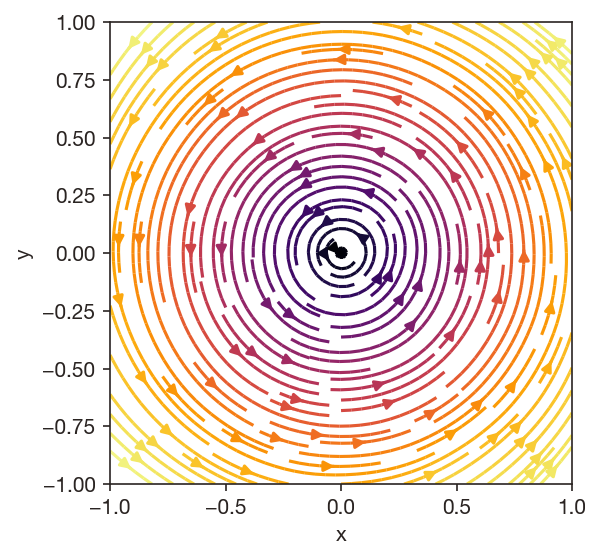

### `plot_isi` — interspike interval histograms

Pool ISIs across a population for a single histogram, or get a
small-multiples grid with one histogram per neuron (good for inspecting
firing-regime heterogeneity).

```python
npl.plot_isi(spikes, dt=0.001, neuron_idxs=[221, 105, 174, 45],
             bins=30, max_isi=0.25, per_neuron=True)
```

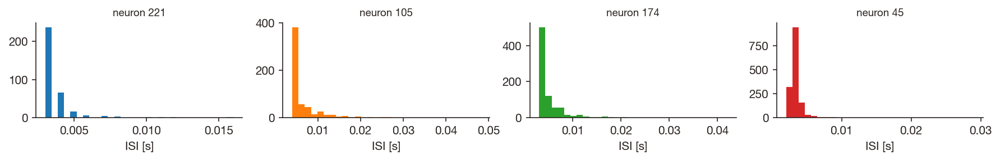

### `plot_weight_matrix` — connection weights / decoders

Heatmap of an arbitrary 2D weight matrix, or pass a ``nengo.Connection`` +
``sim`` and the function will read ``sim.data[conn].weights`` for you. A
diverging colormap with symmetric limits is the default since weights are
typically signed. Pass a :class:`NeuronSorter` (or any permutation array) to
``row_order`` / ``col_order`` to reveal structure that's hidden by the
default neuron indexing.

```python
sorter = npl.NeuronSorter(method='cluster', smoothing=None).fit(
    W, features=sim.data[pre].encoders,
)
npl.plot_weight_matrix(conn, sim=sim, col_order=sorter)
```

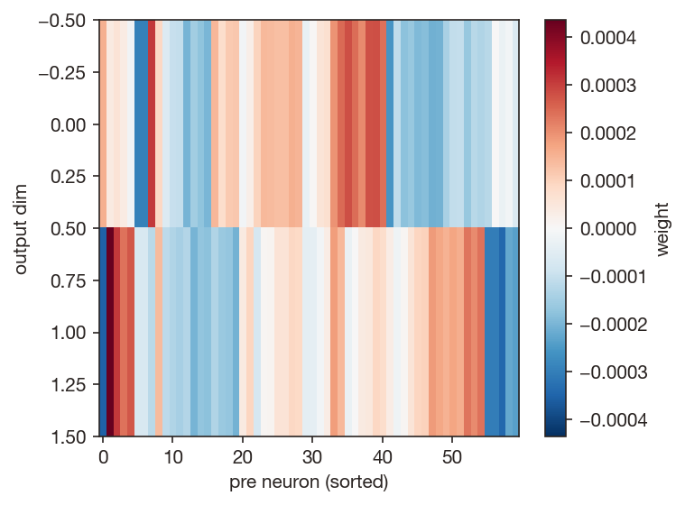

### Connectome plots — `plot_connectome` and `plot_correlation`

Circular ring-plot of a `nengo.Network`'s hierarchy: each ring is one nesting
depth (top-level networks on the outside, ensembles on the inside), wedge
size encodes neuron count by default, and arcs between wedges encode
connections. `plot_correlation` shows a correlation matrix grouped by the
same hierarchy. An interactive variant
(`InteractiveConnectome`) makes wedges and arcs clickable, and a
`ConnectomePlot` node integrates with Nengo GUI.

```python
npl.plot_connectome(model, label_depth=1)
```

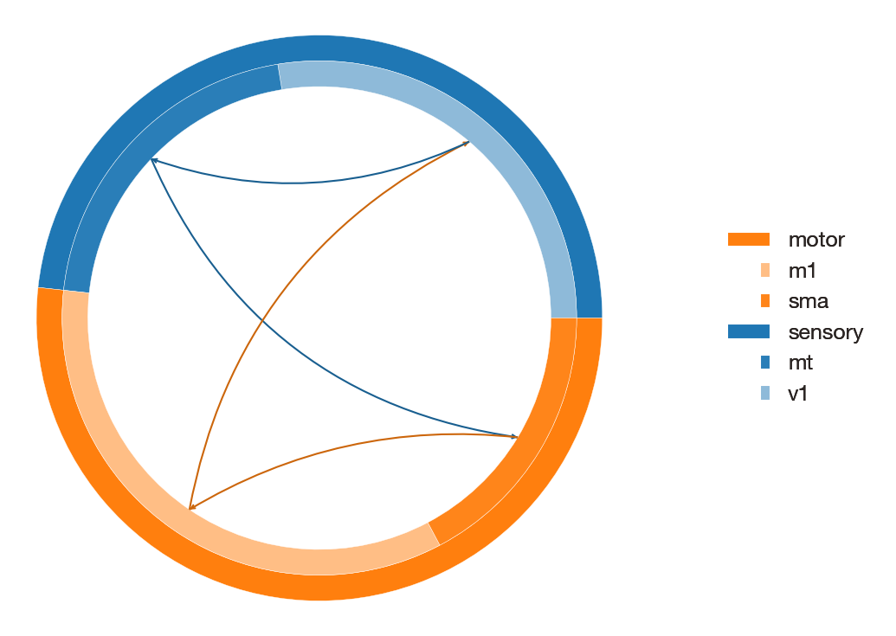

See [`nengoplotlib/connectomes/README.md`](nengoplotlib/connectomes/README.md)
for the full API, including sizing options, hierarchical edge bundling, the
correlation helper (`get_correlation_matrix`), the interactive click handler,
and the Nengo GUI integration.

### `plot_on_atlas` — per-region data on a brain atlas

Map data onto Allen Mouse Brain Atlas regions. Why? Sometimes researchers build nengo model's with populations that roughly map onto partiaulr brain areas and its fun to visualize the model activity on a brain map. Don't take these plots too seriously. 

Pass an atlas name (or id) and a dict keyed by region acronym or full name (`"VISp"` or `"Primary visual area"`).
A **scalar** value fills the region with a solid colour; a `(n_neurons,)`
**array** is laid out *inside the region outline* — as a `pcolormesh` grid, or,
reusing `nengoplotlib.sorting`, a shape-constrained **SOM** (`"som_hex"` /
`"som_rect"`) or **Voronoi** mosaic (`"voronoi"` / `"voronoi_kmeans"`). A value
on a coarse region (e.g. `"Isocortex"`) propagates to its drawn subregions.

```python
import numpy as np
import nengoplotlib as npl

data = {
    "VISp":  np.random.rand(220),   # (n_neurons,) -> laid out inside the region
    "VISpm": np.random.rand(120),
    "RSPv":  0.2,                   # scalar -> solid fill
    "RSPd":  0.8,
}
npl.plot_on_atlas("Mouse, P56, Coronal", data, section=402,
                  array_fill_type="voronoi")
```

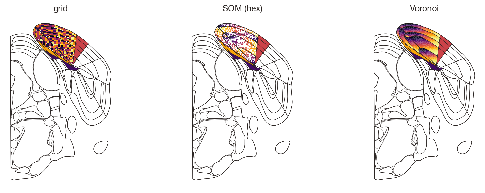

Choose any annotated `section` (or pass `swanson=True` for the whole-brain flat
projection, scalar fills). The neuron layout is driven by optional
`features=`/`positions=` dicts, defaulting to the plotted values. Atlas geometry
(per-section SVGs, the structure ontology, and the Swanson polygons) is
downloaded from the Allen / IBL public APIs on first use and cached under
`~/.cache/nengoplotlib/atlas` (override with `NENGOPLOTLIB_CACHE_DIR`), so
re-runs work offline. See [`examples/plot_on_atlas_demo.py`](examples/plot_on_atlas_demo.py).

### `plot_atlas_animation` — per-region activity over time

The temporal counterpart of `plot_on_atlas`: each region's value is now a time
series — `(n_timesteps,)` for a scalar fill that pulses, or
`(n_timesteps, n_neurons)` for a per-neuron layout (grid / SOM / Voronoi) whose
cells recolour every frame. The geometry is built once and only the colours
update, so a frame matches the equivalent `plot_on_atlas`. Returns a
`matplotlib.animation.FuncAnimation`.

```python
import numpy as np
import nengoplotlib as npl

T, n = 48, 160
sweep = np.linspace(0, 4 * np.pi, T)[:, None]
phase = np.linspace(0, 2 * np.pi, n)[None, :]
data = {
    "VISp":  0.5 + 0.5 * np.sin(sweep - phase),       # (T, n) traveling bump
    "RSPv":  0.5 + 0.5 * np.cos(sweep[:, 0]),         # (T,) scalar pulse
    "RSPd":  0.5 + 0.5 * np.sin(sweep[:, 0] + 2.0),
}
ani = npl.plot_atlas_animation("Mouse, P56, Coronal", data, section=402,
                               array_fill_type="voronoi", tau=0.0)
ani.save("atlas.gif", writer="pillow", fps=14)
```

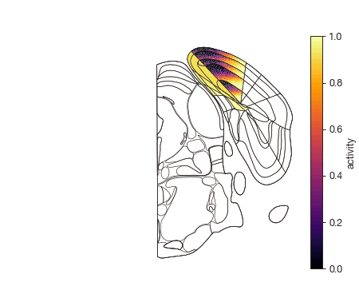

Pass `t=`/`dt=` and a synapse `tau=` to lowpass-filter spike-like activity
before display, and `plot_step=` to advance several timesteps per frame.

---

## Neuron sorting

Most rasters / heatmaps / animations benefit from sorting neurons before
plotting. The `nengoplotlib.sorting` subpackage is the unified entry point.

```python
from nengoplotlib import NeuronSorter, sort_neurons

# Quick one-shot:
sorted_X, sorter = sort_neurons(
    spikes, t=t, method='cluster', n_out=50, smoothing=0.01,
)

# Stateful — fit once, transform many trials:
sorter = NeuronSorter(method='cluster', smoothing=0.01).fit(trial_0, t=t)
sorted_trial_1 = sorter.transform(trial_1)
```

Methods:

- `method='cluster'` — hierarchical clustering (1D only).
- `method='som'` — self-organizing map on a `'line'`, `'rect'`, or `'hex'`
  grid. The SOM is implemented in pure NumPy, no extra dependency.
- `method='voronoi'` — one Voronoi cell per neuron over a 2D embedding
  (`positions_2d=...`), clipped to an alpha-shape outer border.
- `method='voronoi_kmeans'` — k-means in 2D, Voronoi over the centroids.
  Each cluster aggregates its members and gets its own organic polygon.

After fitting, a `NeuronSorter` exposes `positions` (per-input-neuron
coordinates), `order` (1D permutation), `cell_assignments` (2D), and
`merged_positions` (coordinates of post-merge columns) — handy when feeding
the result into `plot_grid_animation`. Voronoi sorts additionally expose
`patches` (a list of `matplotlib.patches.Polygon`, one per cell).

Lower-level helpers are also re-exported for callers who want to compose
their own pipeline: `sort_cluster`, `sort_som`, `voronoi_parcellation`,
`kmeans_voronoi_parcellation`, `SOM`, `merge_1d`, `merge_2d`,
`sample_by_variance`, `sample_by_activity`, `sample_random`, `smooth`.

---

## Installation

```bash
pip install -e .
```

Required: `numpy`, `scipy`, `matplotlib`, `shapely`, `scikit-learn` (the last
two power the Voronoi parcellations and atlas neuron-layout fills). `nengo` is
needed for the connectome subpackage and the example script. `pillow` (or
`ffmpeg`) is needed to save animations.

## Tests

```bash
pytest tests/
```

## Credits

The neuron-sort and spike-raster primitives in `nengoplotlib.sorting`
(`sort_cluster`, `merge_1d`, `sample_by_variance`, `sample_by_activity`) and
`nengoplotlib.raster.plot_spikes` are adapted from
[`nengo_extras.plot_spikes`](https://github.com/nengo/nengo-extras), updated
for NumPy ≥ 2.0 and generalized to 2D layouts. SOM code options were inspired by
MiniSom.
