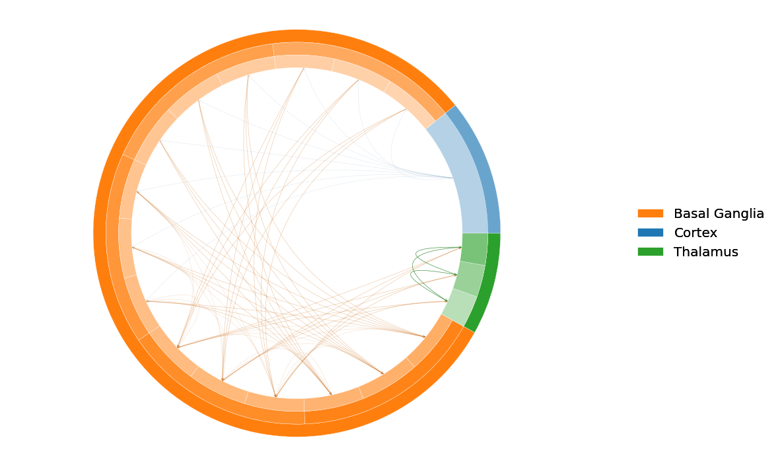
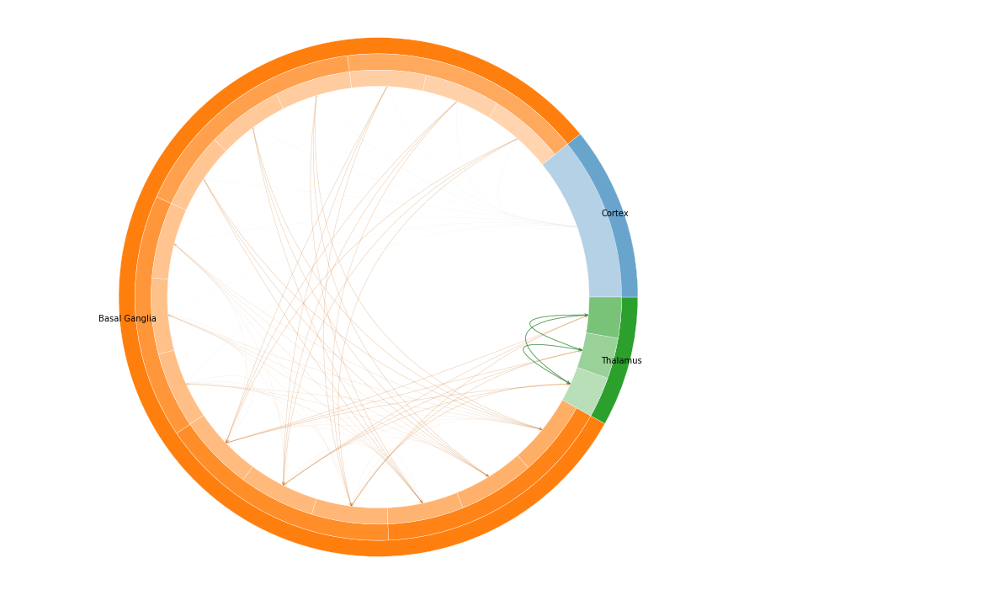
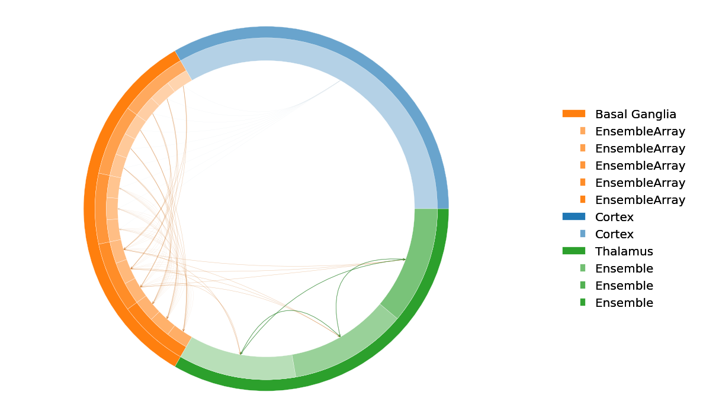
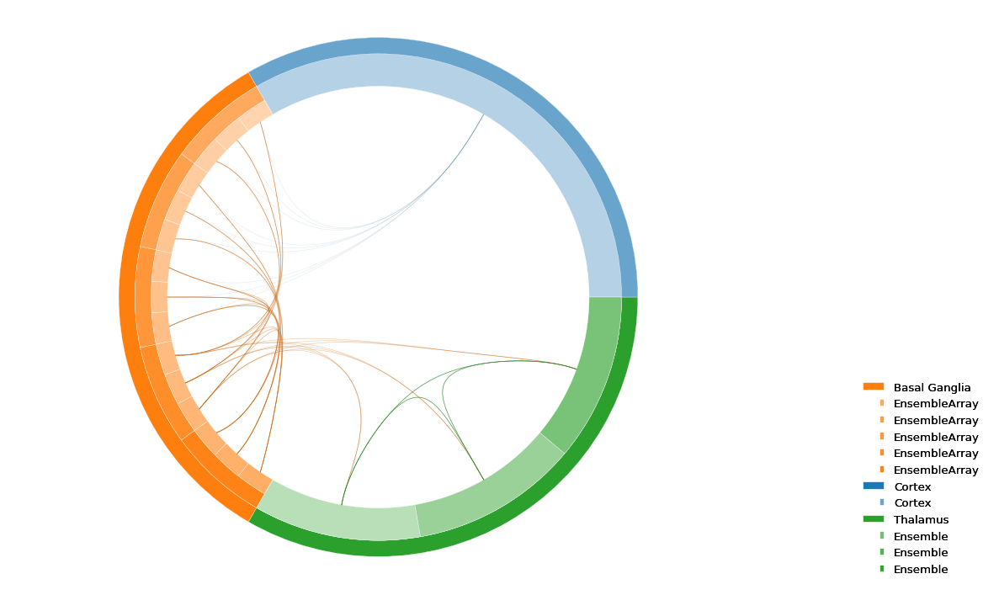
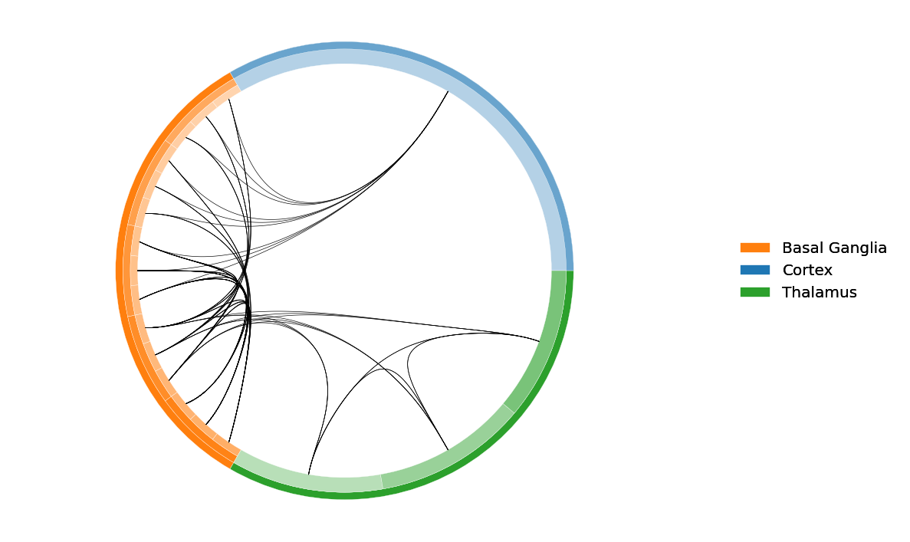

# `connectomes`

Connectome plots of Nengo networks. Given a `nengo.Network`, walk its
hierarchy (sub-networks, EnsembleArrays, ensembles), draw each level as a
ring, and overlay connection arcs between groups.

Public entries:

```python
from connectomes import (
    plot_connectome,
    plot_correlation,
    get_correlation_matrix,
    InteractiveConnectome,
    ConnectomePlot,
)
```

| Function                  | Input                        | Output                          |
|---------------------------|------------------------------|---------------------------------|
| `plot_connectome`         | a `nengo.Network`            | `(ax, fig, plot_objs)`          |
| `plot_correlation`        | a correlation matrix + model | `(fig, ax)`                     |
| `get_correlation_matrix`  | a `nengo.Network` + sim time | `(matrix, ensembles, signals)`  |
| `InteractiveConnectome`   | a rendered `plot_objs` dict  | click handler                   |
| `ConnectomePlot`          | (nothing — captures parent)  | a `nengo.Node` for Nengo GUI    |

## Quick start

```python
import matplotlib.pyplot as plt
from connectomes import plot_connectome

fig, ax = plt.subplots(figsize=(10, 6))
plot_connectome(model, ax=ax)
plt.show()
```



## `plot_connectome` options

```python
plot_connectome(
    model,
    size_by='n_neurons',     # 'n_neurons' | 'n_children' | callable(Node)->float
    equalize_at=None,        # 0-based depth to equalize; None = no warp
    connection_at=None,      # 0-based depth for connection aggregation; None = deepest
    label_depth=0,           # 0-based deepest ring to label (ignored if labels='none')
    labels='legend',         # 'legend' | 'inline' | 'none'
    max_depth=10,            # cap on number of rings rendered
    total_width=0.2,         # radial thickness of the whole ring stack
    connection_type='arc',   # 'arc' | 'bundled'
    arc_params=None,         # override edge style: {'lw', 'alpha', 'color'}
    font_size=12,
    legend_loc='center right',
    ax=None,
)
```

Every depth-named option (`equalize_at`, `connection_at`, `label_depth`) is
**0-based**: `0` is the outermost ring, `1` is the next inward, etc.

### Sizing — `size_by` + `equalize_at`

`size_by` decides how each wedge's angular width is computed:

- `'n_neurons'` (default) — wedge size = ensemble's `n_neurons`; internals
  are the sum of their children.
- `'n_children'` — wedge size = number of leaf-ensemble descendants
  (leaves count as 1).
- a callable `f(Node) -> float` — applied at every leaf for fully custom
  sizing.

`equalize_at` (0-based, optional) forces wedges at that depth to be
equal-sized; ancestors and descendants are warped proportionally so the
plot stays consistent. `equalize_at=0` equalizes the outermost ring (most
common — keeps one large area from dominating). `None` means no warp.

### Labels — `labels` + `label_depth`

- `labels='legend'` (default): indented hierarchical legend off to one
  side. Sibling members of an `EnsembleArray` collapse into a single legend
  entry.
- `labels='inline'`: text drawn directly on the wedges. Use a small
  `font_size` to keep them readable.
- `labels='none'`: no labels at all.

`label_depth` is the **deepest** ring to label (inclusive, 0-based).
`label_depth=0` labels only the outermost ring; `label_depth=1` labels the
outer two rings; etc.

| `labels='inline'` | `label_depth=1` (legend, equalized) |
|---|---|
|  |  |

### Connections — `connection_type` + `connection_at` + `arc_params`

- `'arc'`: a 2-D curve directly between each pair of connected groups.
  Fast; best for shallow or sparse models.
- `'bundled'`: hierarchical edge bundling — curves dip in toward the lowest
  common ancestor of the two endpoints, grouping related connections
  visually. Requires `connection_at > 0`.

`connection_at` (0-based, optional) is the depth at which connections are
aggregated. `connection_at=0` collapses every projection into a single
top-level inter-area arc; passing a deeper value keeps finer ensemble-level
detail. `None` (default) uses the deepest rendered depth.

`arc_params` overrides the default per-edge style. Recognized keys:

- `lw` — fixed linewidth (otherwise scaled by the edge's share of its
  source's outgoing weight).
- `alpha` — fixed transparency (same scaling default).
- `color` — fixed RGB / named color (otherwise inherits a darkened version
  of the source's top-level ring color).

| Bundled, full hierarchy | Bundled, uniform black arcs |
|---|---|
|  |  |

## `get_correlation_matrix`

Quick helper that probes every (or a chosen subset of) ensemble, runs a
simulation, and computes the pairwise correlation matrix of their filtered
spike outputs. Designed to feed straight into `plot_correlation` and
`InteractiveConnectome`.

```python
from connectomes import get_correlation_matrix, plot_correlation

corr, ensembles, signals = get_correlation_matrix(model, T=12)
fig, ax = plot_correlation(corr, model, ensembles=ensembles, label_depth=1)
```

Optional kwargs let you tune the probe + sim:

- `probe_ensembles`: list of ensembles to probe (default: `model.all_ensembles`).
- `max_neurons` (100): cap on neurons sampled per ensemble.
- `sample_every` (0.1): probe sample period, seconds.
- `synapse` (0.1): probe filter time constant.

Returns three things:

- `corr` — square `(N, N)` correlation matrix.
- `ensembles` — list of probed ensembles in matrix row / column order.
- `signals` — `dict[get_key(ens) -> per-timestep array]`; useful as the
  `signals=` kwarg of `InteractiveConnectome`.

## `plot_correlation`

Plot a correlation matrix with rows / columns grouped by hierarchy.

```python
fig, ax = plot_correlation(
    corr_matrix,
    model,
    ensembles=None,    # which ensembles correspond to the matrix rows/cols
    label_depth=1,     # 0-based ancestry depth to group by
)
```

If `ensembles=None`, the matrix is assumed to contain every leaf ensemble
in DFS order (same as `build_tree(model).leaves()`). Pass an explicit
`ensembles` list — typically the one returned by `get_correlation_matrix` —
when you only probed a subset of the network; any ensemble in the list that
isn't a leaf of the model's hierarchy is silently skipped.

## `InteractiveConnectome`

Wraps an already-rendered plot to make wedges and connection arcs
clickable. Each click toggles a selection:

- **Click a wedge** → white 3-px outline, raised z-order, yellow hover-text
  popup with the wedge label. If `times`+`signals` are supplied, an inset
  time-series plot of that ensemble's signal pops up in the upper-right
  corner of the axes.
- **Click a legend label** → same effect as clicking the corresponding
  wedge (toggle highlight + show the signal inset). A leaf that's rendered
  across multiple rings has its wedges selected / deselected as a group.
- **Click a connection arc** → linewidth bumped 5×, alpha forced to 1.0,
  hover-text popup with the `"src -> dst"` label.
- **Click the same item again** → deselects it and dismisses its popups.
- **Click empty space** → dismisses popups but keeps existing selections.

### Backend requirement

This relies on matplotlib's `button_press_event`, which only fires under an
**interactive backend**:

| Environment | What to use |
|---|---|
| Jupyter notebook / Lab | `%matplotlib widget` (requires `pip install ipympl`), or `%matplotlib qt`/`tk` for a pop-out window |
| Plain Python script    | any GUI backend: `QtAgg`, `TkAgg`, `MacOSX`, `GTK3Agg`, … |
| **Won't work**         | `agg`, `pdf`, `svg`, default Jupyter `inline` (these are non-interactive) |

If clicks seem to do nothing, that's almost always the backend.

### Constructor

```python
InteractiveConnectome(fig, ax, wedges, lines, times=None, signals=None)
```

| Param     | Type                                | Meaning                                                                                          |
|-----------|-------------------------------------|--------------------------------------------------------------------------------------------------|
| `fig`     | `matplotlib.figure.Figure`          | The figure returned by `plot_connectome`.                                                        |
| `ax`      | `matplotlib.axes.Axes`              | The axes the connectome is drawn into. Clicks outside this axes are ignored.                     |
| `wedges`  | `list[(Wedge, str)]`                | `plot_objs['wedges']` — pairs of the wedge patch and its label string (in `get_key` form).       |
| `lines`   | `list[(Line2D \| PathPatch, str)]`  | `plot_objs['lines']` — pairs of the connection object and a `"src -> dst"` label.                |
| `times`   | `np.ndarray`, optional              | Time vector for inset plots. `None` skips the inset; just highlights and shows the hover text.   |
| `signals` | `dict[str, np.ndarray]`, optional   | Per-ensemble time series, keyed by the same label strings carried in `wedges`. `None` ⇒ no inset.|

### Methods

- `clear_selections()` — deselect everything and dismiss popups.
- `get_selected_items()` — returns `{'wedges': [(idx, label), …], 'lines': [(idx, label), …]}` for the currently highlighted items.

### Example

```python
%matplotlib widget   # or e.g. %matplotlib qt
import numpy as np
from connectomes import (
    plot_connectome, get_correlation_matrix, InteractiveConnectome,
)

ax, fig, plot_objs = plot_connectome(model, equalize_at=0)

corr, ensembles, signals = get_correlation_matrix(model, T=5)
times = np.arange(next(iter(signals.values())).size) * 0.1

handler = InteractiveConnectome(
    fig, ax,
    plot_objs['wedges'], plot_objs['lines'],
    times=times, signals=signals,
)
```

## `ConnectomePlot` — Nengo GUI display

A `nengo.Node` subclass that renders the parent network's connectome as
inline SVG and exposes it via `output._nengo_html_` — the attribute that
Nengo GUI looks for when drawing a node's panel.

```python
import nengo
from connectomes import ConnectomePlot

with model:
    ConnectomePlot(label="connectome",
                   size_by='n_neurons', equalize_at=0, label_depth=1)
```

The surrounding network is captured automatically via
`nengo.Network.context`; pass `network=` explicitly to override. Any keyword
accepted by `plot_connectome` (`size_by`, `equalize_at`, `connection_type`,
`labels`, `arc_params`, …) can be forwarded.

The plot is built once on the first simulation step and cached on the
node's output callable — every subsequent step serves the same SVG with no
matplotlib re-render. Until that first step fires, a small placeholder is
shown.

## Package structure

```
connectomes/
    tree.py         Node, build_tree, collapse_passthroughs
    sizing.py       compute_sizes, by_n_neurons, by_n_descendants
    layout.py       assign_angles, equalize
    connections.py  Edge, extract_connections, aggregate_to_level, lca
    draw.py         polar_to_cartesian, bezier_curve, draw_arc, draw_path
    legend.py       build_hierarchical_legend
    plot.py         _plot_connectome  (data-level orchestrator, internal)
    api.py          plot_connectome   (model -> plot, the public entry)
    correlation.py  plot_correlation, get_correlation_matrix
    interactive.py  InteractiveConnectome
    gui.py          ConnectomePlot   (Nengo GUI Node)
    keys.py         get_key, display_label
```

Everything below `plot_connectome` is reachable as `connectomes.<module>`
for callers that want to build their own pipelines.
